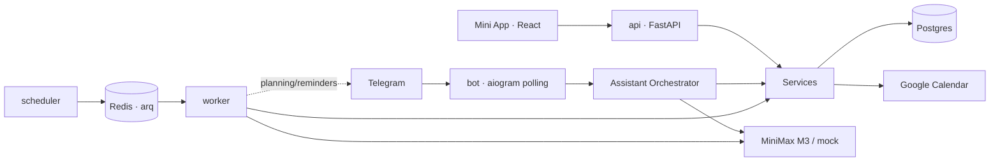

# Lumi

**Lumi is a productivity assistant in Telegram.** One chat plus a focused Mini App for Today, Tasks, Sessions, Calendar, and Settings. Lumi turns task and calendar messages into a clear action plan.

```text
You:   Remind me tomorrow at 10 to write Sasha about the contract,
       and find an architecture slot after lunch.

Lumi:  Done.
       Created a task: write Sasha about the contract.
       Reminder: tomorrow at 10:00.
       Found a 14:30-16:00 window for architecture - accept the focus block?
       [Accept block]
```

## MVP capabilities

- **Productivity chat** on MiniMax M3: task, calendar, focus, planning, and work-context requests only; unsupported general Q&A, research, email, news, image analysis, and arbitrary automations get an explicit boundary reply
- **Tasks and reminders** from natural language, with confirmations for ambiguous cases
- **Focus sessions** with a route-safe timer, manual logging, reflection, and local-time analytics
- **Calendar**: internal calendar, Google Calendar sync and confirmed event creation, Yandex.Calendar read-only CalDAV sync, free slots, day planning with focus blocks
- **Memory**: Lumi remembers preferences and projects as part of assistant context
- **Mini App**: English-only UI with Today, Tasks, Sessions, Calendar, and Settings
- **Observability**: every agent run, LLM call, and action is logged

Security by default: Telegram ID allowlist, initData validation, confirmation for Google Calendar writes, a code-enforced tool allowlist, and no LLM access to shell or files.

## Architecture at a glance



Six containers: `postgres`, `redis`, `api`, `bot`, `worker`, `scheduler`. Details: [docs/architecture.md](docs/architecture.md).

## Quick start (5 minutes)

Requirements: Docker (OrbStack/Docker Desktop), Node 18+, a bot token from [@BotFather](https://t.me/BotFather).

```bash
# 1. Prepare local files
make setup                 # creates .env from the template and data/ directories

# 2. Fill .env:
#    TELEGRAM_BOT_TOKEN        - from @BotFather
#    ALLOWED_TELEGRAM_USER_IDS - your id (check with @userinfobot)
#    MINIMAX_API_KEY           - MiniMax key (or LLM_PROVIDER=mock without a key)

# 3. Build and start
make frontend-build        # builds the Mini App into frontend/dist
make up-detached           # starts all 6 services
make migrate               # applies migrations
make seed                  # creates/checks the user and main conversation

# 4. Check without external keys
make smoke                 # end-to-end mock LLM check; should print SMOKE OK
```

Now send `/start` to your bot in Telegram.

### Mini App locally and in Telegram

The backend serves the built `frontend/dist` at `/app`. After frontend changes, always run:

```bash
make frontend-build
docker compose up -d --force-recreate api
```

Browser check without Telegram `initData`:

```bash
make up-detached
make dev-auth-up
open http://localhost:8001/app/
```

Fastest Telegram Mini App path:

```bash
make miniapp-local-up
```

This builds the frontend, starts Docker, creates a fresh `cloudflared` tunnel in `tmux`, writes `APP_PUBLIC_URL`, recreates `api/bot`, and verifies the default and per-chat Telegram menu buttons.

Manual path:

```bash
make tunnel
```

Copy the generated `https://...trycloudflare.com` URL into `.env`:

```dotenv
APP_PUBLIC_URL=https://your-tunnel.trycloudflare.com
FRONTEND_PUBLIC_PATH=/app/
```

Then reload API and Mini App menu state:

```bash
docker compose up -d --force-recreate api bot
curl "$APP_PUBLIC_URL/health"
```

Open `/app` from the bot or use the menu button. If Telegram shows a blank page or robot icon, check both the default menu and the chat-specific menu: Telegram can keep an old button for a specific chat.

### Yandex.Calendar (optional)

In the Mini App: Settings -> Yandex.Calendar -> username + app password (id.yandex.ru -> Security -> App passwords -> Calendar CalDAV). Read-only.

### Google Calendar (optional)

1. In Google Cloud Console, create an OAuth client (**Desktop app**), enable Calendar API, and add yourself to test users.
2. Save the client secret as `data/secrets/google_client_secret.json`.
3. Run `make google-auth-local`; a browser opens for consent.

After that, Google Calendar sync works. Without Google, Lumi still works fully with the internal calendar.
External Google Calendar event creation is available only after explicit confirmation.

## Bot commands

| Command | What it does |
|---|---|
| plain text | main flow: tasks, reminders, planning, memory |
| `/today` | day summary: meetings, tasks, attention items |
| `/tasks` | active tasks |
| `/plan` | build a day plan with focus blocks |
| `/app` | open the Mini App |
| `/settings` | connection status |

## Useful commands

```bash
make logs            # tail logs for all services
make test            # pytest in the container
make lint            # ruff + mypy
make smoke           # end-to-end mock LLM check
make seed-focus-demo # local-only Focus demo data; replaces only its marked batch
make down            # stop everything
make reset-local-db  # remove volumes and start over
COMPOSE_PROJECT_NAME=lumi_<task_slug> make agent-clean  # clean an agent branch runtime
```

## Documentation

- [docs/architecture.md](docs/architecture.md) - services, flows, diagrams
- [docs/database.md](docs/database.md) - database schema and ERD
- [docs/context-management.md](docs/context-management.md) - context, memory, compaction
- [docs/connectors.md](docs/connectors.md) - Google Calendar and Yandex.Calendar
- [docs/runbook.md](docs/runbook.md) - operations, debugging, common issues
- [docs/agent-qa.md](docs/agent-qa.md) - agent self-QA via Telegram Web, Mini App, DB, and logs
- [docs/focus-timer-design.md](docs/focus-timer-design.md) - Sessions interaction and responsive design direction
- [docs/security.md](docs/security.md) - threat model and controls
- [docs/api-contract.md](docs/api-contract.md) - Mini App API contract

## Stack

Python 3.12 · FastAPI · aiogram 3 · SQLAlchemy 2 (async) · Alembic · Postgres 16 · Redis 7 · arq · croniter · React 18 · TypeScript · Vite · Tailwind · TanStack Query · MiniMax M3

## MVP limits

Local single-user product: one Telegram account in the allowlist, polling instead of webhooks, text-only productivity chat, local files, no voice. The bot runs while the Mac is awake (`caffeinate -dimsu`). VPS migration plan: [docs/runbook.md#production](docs/runbook.md#production).
