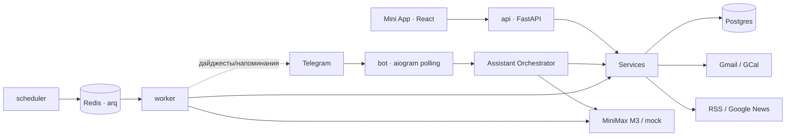

# Lumi

**Lumi — личный AI-ассистент в Telegram.** Один чат и премиальное Mini App поверх задач, календаря, почты, новостей и долгосрочной памяти. Lumi превращает поток сообщений, писем и встреч в понятный план действий.

```text
Ты:    Напомни завтра в 10 написать Саше по договору,
       а после обеда найди слот на архитектуру.

Lumi:  Готово.
       Создал задачу: написать Саше по договору.
       Напоминание: завтра в 10:00.
       Нашел окно 14:30–16:00 под архитектуру — принять фокус-блок?
       [✓ Принять блок]
```

## Что умеет MVP

- **Чат-ассистент** на MiniMax M3 — stateless LLM, всё состояние в собственной БД
- **Задачи и напоминания** из естественного языка, с подтверждениями для неоднозначных
- **Календарь** — внутренний + синк Google Calendar и Яндекс.Календаря (CalDAV, read-only), свободные слоты, план дня с фокус-блоками
- **Почта** — read-only triage Gmail: что ждет ответа, что важно, задачи из писем
- **Новости** — дайджесты по темам (Google News RSS) по расписанию
- **Память** — Lumi запоминает предпочтения и проекты; всё видно и управляемо в Mini App
- **Автоматизации** — свои cron-расписания (новости, почта, план дня, синк, свой промпт); создаются пользователем в Mini App, дефолтных нет
- **Mini App** — Today, Tasks, Calendar, Inbox, News, Automations, Memory, Settings, Agent Runs
- **Наблюдаемость** — каждый запуск агента, каждый вызов LLM и каждое действие в журнале

Безопасность по умолчанию: allowlist Telegram ID, валидация initData, подтверждение для
внешних записей (календарь/почта), никакого доступа LLM к shell или файлам.

## Архитектура в одну картинку



Шесть контейнеров: `postgres`, `redis`, `api`, `bot`, `worker`, `scheduler`. Подробности — в [docs/architecture.md](docs/architecture.md).

## Быстрый старт (5 минут)

Нужны: Docker (OrbStack/Docker Desktop), Node 18+, токен бота от [@BotFather](https://t.me/BotFather).

```bash
# 1. Подготовка
make setup                 # создаст .env из шаблона и data/-каталоги

# 2. Заполни .env:
#    TELEGRAM_BOT_TOKEN        — от @BotFather
#    ALLOWED_TELEGRAM_USER_IDS — твой id (узнать: @userinfobot)
#    MINIMAX_API_KEY           — ключ MiniMax (или LLM_PROVIDER=mock без ключа)

# 3. Сборка и запуск
make frontend-build        # соберет Mini App в frontend/dist
make up-detached           # поднимет все 6 сервисов
make migrate               # применит миграции
make seed                  # создаст пользователя, темы новостей, автоматизации

# 4. Проверка без ключей
make smoke                 # сквозной тест на mock LLM — должно быть SMOKE OK
```

Теперь напиши своему боту `/start` в Telegram.

### Mini App локально и в Telegram

Backend отдает собранный `frontend/dist` на `/app`. После изменений фронта всегда делай:

```bash
make frontend-build
docker compose up -d --force-recreate api
```

Проверка в обычном браузере без Telegram `initData`:

```bash
make up-detached
make dev-auth-up
open http://localhost:8001/app/
```

Самый быстрый путь поднять Mini App для Telegram:

```bash
make miniapp-local-up
```

Команда соберет фронтенд, поднимет Docker, создаст fresh `cloudflared` tunnel в `tmux`,
запишет `APP_PUBLIC_URL`, пересоздаст `api/bot` и проверит default/per-chat Telegram menu.
Ручной вариант:

```bash
make tunnel
```

Скопируй выданный `https://…trycloudflare.com` в `.env`:

```dotenv
APP_PUBLIC_URL=https://your-tunnel.trycloudflare.com
FRONTEND_PUBLIC_PATH=/app/
```

Потом синхронизируй API и кнопку Mini App:

```bash
docker compose up -d --force-recreate api bot
curl "$APP_PUBLIC_URL/health"
```

Открой `/app` у бота или кнопку меню. Если Telegram показывает пустой экран с роботом,
проверь не только default menu, но и chat-specific menu: Telegram может держать старую
кнопку для конкретного чата.

### Яндекс.Календарь (опционально)

Прямо в Mini App: Settings → Яндекс.Календарь → логин + пароль приложения
(id.yandex.ru → Безопасность → Пароли приложений → «Календарь CalDAV»). Read-only.

### Google (Gmail + Calendar, опционально)

1. В Google Cloud Console создай OAuth client (**Desktop app**), включи Gmail API и Calendar API,
   добавь себя в test users.
2. Сохрани client secret как `data/secrets/google_client_secret.json`.
3. `make google-auth-local` — откроется браузер, дай доступ.

После этого работают `/email`, синк календаря и утренний разбор почты. Без Google
Lumi полноценно работает на внутреннем календаре.

## Команды бота

| Команда | Что делает |
|---|---|
| обычный текст | главный сценарий: задачи, напоминания, планирование, память |
| `/today` | сводка дня: встречи, задачи, что требует внимания |
| `/tasks` | активные задачи |
| `/plan` | собрать план дня с фокус-блоками |
| `/news` | новостной дайджест по твоим темам |
| `/email` | разбор почты (нужен Google) |
| `/app` | открыть Mini App |
| `/settings` | статус подключений |

## Полезные команды

```bash
make logs            # хвост логов всех сервисов
make test            # pytest в контейнере (50 тестов)
make lint            # ruff
make smoke           # сквозная проверка на mock LLM
make down            # остановить всё
make reset-local-db  # снести volumes и начать заново
```

## Документация

- [docs/architecture.md](docs/architecture.md) — сервисы, потоки, диаграммы
- [docs/database.md](docs/database.md) — схема БД и ERD
- [docs/context-management.md](docs/context-management.md) — контекст, память, compaction
- [docs/connectors.md](docs/connectors.md) — Google, RSS, как добавить Outlook
- [docs/runbook.md](docs/runbook.md) — операции, отладка, типовые проблемы
- [docs/security.md](docs/security.md) — модель угроз и контроли
- [docs/api-contract.md](docs/api-contract.md) — контракт API Mini App

## Стек

Python 3.12 · FastAPI · aiogram 3 · SQLAlchemy 2 (async) · Alembic · Postgres 16 · Redis 7 ·
arq · croniter · React 18 · TypeScript · Vite · Tailwind · TanStack Query · MiniMax M3

## Ограничения MVP

Локальный однопользовательский продукт: один Telegram-аккаунт в allowlist, polling вместо
webhook, файлы локально, без голосовых. Бот работает, пока Mac не спит (`caffeinate -dimsu`).
План миграции на VPS — в [docs/runbook.md](docs/runbook.md#производство).
