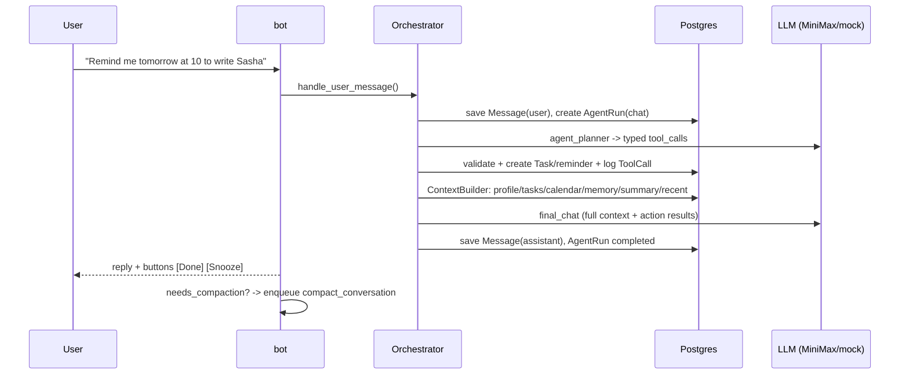
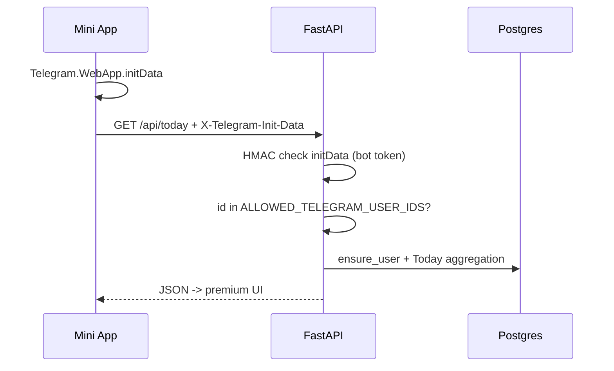
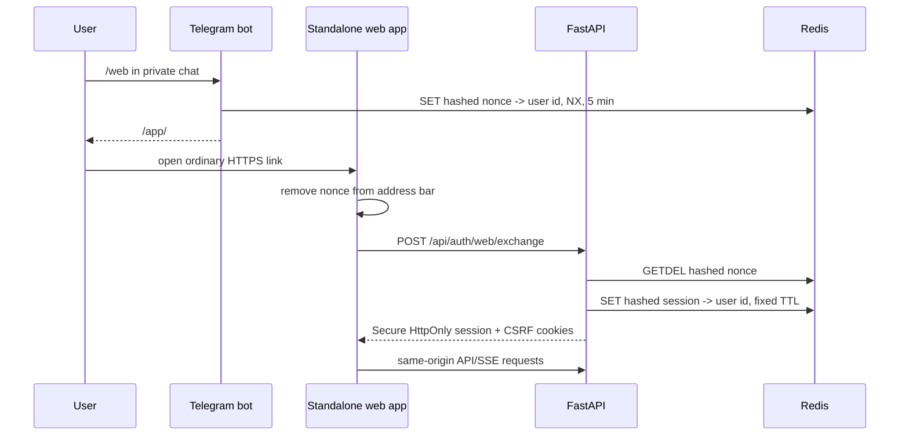
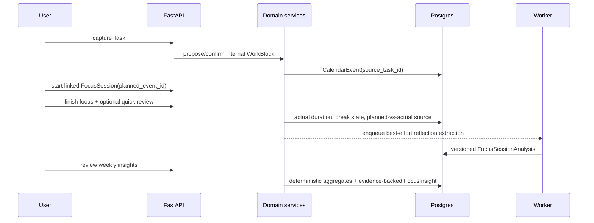
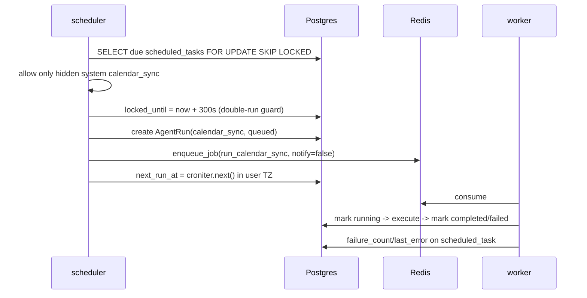

# Lumi Architecture

Core principle: **the LLM is stateless, the backend is stateful**. The model provider stores nothing; every call receives a freshly assembled context from Postgres. This makes the system portable across providers, debuggable, and cheaper to manage at the context layer.

## Services (Docker Compose)

| Service | Command | Purpose |
|---|---|---|
| `postgres` | postgres:16-alpine | source of truth: messages, tasks, memory, calendar, logs |
| `redis` | redis:7-alpine | arq queue and coordination |
| `api` | `uvicorn lumi.main:app` | shared web/Mini App REST API, initData and web-session validation, `/app` static files |
| `bot` | `python -m lumi.bot.runner` | aiogram long polling, commands, callbacks |
| `worker` | `python -m lumi.worker.main` | arq jobs: assistant turns, planning, calendar sync, reflection extraction, reminders, compaction |
| `scheduler` | `python -m lumi.scheduler.main` | every 30s: due system `calendar_sync` tasks -> queue |

All four Python processes use the same `lumi-backend` image: one build, different commands.

## System map

```mermaid
flowchart TD
    U[User in Telegram] -->|private chat| TG[Telegram Bot API]
    TG -->|long polling| BOT[bot · aiogram]
    BOT --> GUARD[allowlist + private-only]
    GUARD --> ORCH[AssistantOrchestrator]
    ORCH --> PLAN[Structured planner]
    ORCH --> CTX[ContextBuilder]
    ORCH --> LLMGW[LLMGateway]
    LLMGW --> MMX[MiniMax M3]
    LLMGW --> MOCK[MockLLM]
    ORCH --> SVCS[TaskService · CalendarService · FocusService · ConfirmationService]
    SVCS --> PG[(Postgres)]
    CTX --> PG

    WEB[Standalone web · React/Vite] -->|Secure session cookie| API[api · FastAPI]
    MA[Mini App · React/Vite] -->|X-Telegram-Init-Data| API
    API -->|SSE /api/realtime| MA
    API -->|SSE /api/realtime| WEB
    API --> AUTH[initData or Redis web session + allowlist]
    API --> SVCS
    SVCS --> REFLECT[versioned reflection analysis]
    SVCS --> INSIGHTS[deterministic focus insights]
    REFLECT --> PG
    INSIGHTS --> PG
    SVCS --> UIE[ui_events outbox]
    UIE --> PG
    UIE -->|after commit| RT[(Redis · pub/sub)]
    RT --> API

    SCHED[scheduler] -->|due tasks| Q[(Redis · arq)]
    API -->|run now| Q
    BOT -->|/plan| Q
    Q --> WRK[worker]
    WRK --> SVCS
    WRK --> LLMGW
    WRK --> GOOGLE[Google Calendar]
    WRK -->|sendMessage| TG
```



## Chat message flow



Key detail: the planner never executes actions. The backend validates each retained productivity tool, writes a `tool_calls` audit row, and only then executes it. Unsupported domains use a deterministic `out_of_scope` reply; unknown/stale tool names are logged as skipped. The final reply receives only backend-confirmed action results, so it cannot turn a proposal into fake success.

## Mini App flow



## Standalone web login flow



Telegram initData remains the first-priority credential. Standalone sessions are
server-side and revocable; unsafe cookie-authenticated requests also require the
exact public origin and the derived CSRF value.

## Product V2 focus loop



The WorkBlock, Task, and FocusSession remain separate records. Finishing focus
does not complete the Task. Break time is stored on the session but excluded
from actual focus duration. Manual/edit session ranges are capped at 240
minutes. Reflection extraction is optional and failure-safe; insights require
validated aggregate evidence and never mutate schedule or preferences.

Explicit planning and calendar-sync endpoints create an `agent_run`, **commit**, and enqueue a Redis job. The Mini App keeps a `GET /api/realtime` SSE stream open: the backend writes small `ui_events` inside the same transaction, publishes them to Redis only after commit, and the frontend invalidates React Query and refetches current REST endpoints. `GET /api/agent-runs/{id}` remains available for observability and fallback polling.

## System Calendar sync flow



Legacy user-created scheduled rows are retained for audit/history but disabled when encountered; no schema or table is dropped. Reminders are a separate arq cron in the worker, running every minute: `find_due_reminders()` across all users, Telegram delivery with buttons, and idempotency via `metadata.reminder_sent_at`.

## Code layers

```text
bot/api  ->  assistant/orchestrator  ->  services  ->  connectors / llm  ->  DB / external APIs
```

- `lumi/assistant/` - orchestrator, context_builder, signal_extractor, memory_service, compaction, prompts
- `lumi/services/` - tasks, calendar/WorkBlocks, planning/Today, focus/breaks,
  reflection analysis, focus insights, confirmations, runs, audit, users, notifier
- `lumi/connectors/` - Google Calendar and Yandex.Calendar
- `lumi/llm/` - base protocol, minimax, mock, gateway (llm_calls logging), json_utils
- `lumi/security/` - telegram_auth (HMAC initData), crypto (Fernet)
- `lumi/api/` - deps (auth), routes/*, serializers, run_helper
- `lumi/bot/` - handlers, keyboards, formatting, runner
- `lumi/worker/`, `lumi/scheduler/` - background processing

Rule: bot handlers and API routes never call MiniMax or Calendar providers directly; they go through services and connectors. Every proposed tool that reaches the executor has a row in `tool_calls`, every model call is in `llm_calls`, and every run is in `agent_runs`.

## Agent run lifecycle

```text
queued -> running -> completed
                 -> failed (error_message, error_json)
```

`trigger`: `telegram_message` / `telegram_command` / `telegram_callback` / `scheduled_task` / `manual_api` / `system`.

## Confirmations (two-phase actions)

Risky or low-confidence actions are not executed immediately:

```text
Planner tool call -> PendingConfirmation(pending) + [yes]/[no] buttons in Telegram
-> callback confirm:<id> -> ConfirmationExecutor -> action -> audit_log
```

Always require confirmation: writes to external Google Calendar and tasks/memory below the confidence threshold. User-defined automations, email/news actions, image analysis, research, and general Q&A are outside the product scope.

## Extension points

| Today | Replacement | Where to change |
|---|---|---|
| MiniMax M3 | OpenAI/Anthropic/local | `lumi/llm/` - new provider behind `LLMProvider` |
| keyword memory | pgvector | `MemoryService.retrieve_relevant` |
| polling | webhook | `bot/runner.py` |
| no real-time | SSE + Redis fanout | `services/realtime.py`, `/api/realtime`, `ui_events` |
| local files | S3 | `files` table already exists |
