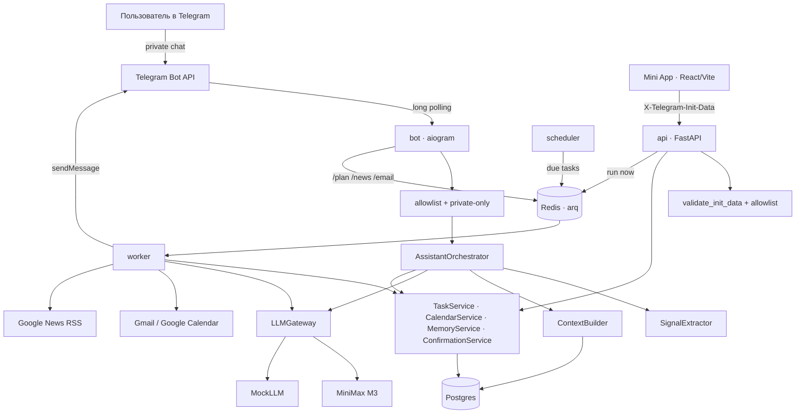
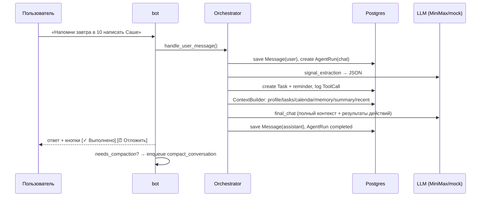
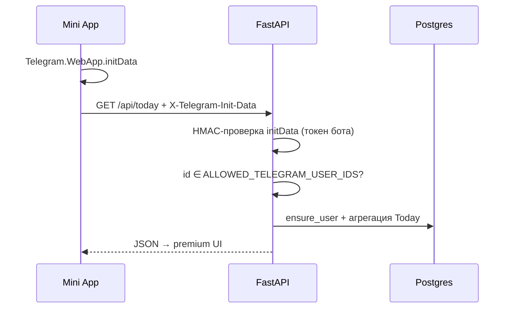
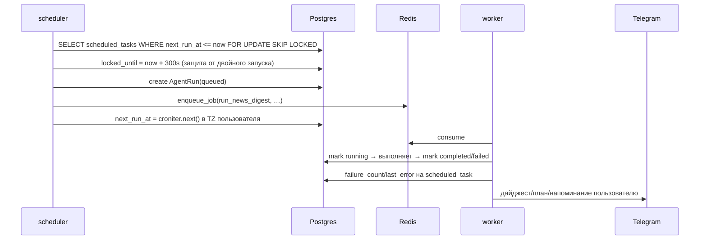

# Архитектура Lumi

Главный принцип: **LLM stateless, backend stateful**. Провайдер модели не хранит ничего —
каждый вызов получает свежесобранный контекст из Postgres. Это делает систему переносимой
между провайдерами, отлаживаемой и дешёвой в управлении контекстом.

## Сервисы (Docker Compose)

| Сервис | Команда | Назначение |
|---|---|---|
| `postgres` | postgres:16-alpine | вся правда: сообщения, задачи, память, календарь, журналы |
| `redis` | redis:7-alpine | очередь arq, координация |
| `api` | `uvicorn lumi.main:app` | REST для Mini App, валидация initData, статика `/app` |
| `bot` | `python -m lumi.bot.runner` | aiogram long polling, команды, колбэки |
| `worker` | `python -m lumi.worker.main` | arq: дайджесты, triage, планирование, синк, напоминания (cron), compaction |
| `scheduler` | `python -m lumi.scheduler.main` | каждые 30 с: due `scheduled_tasks` → очередь |

Все четыре python-процесса используют один образ `lumi-backend` (один `build`, разные команды).

## Карта системы



## Поток сообщения в чате



Ключевая деталь: extraction и финальный ответ — **два разных вызова LLM**. Extraction
возвращает строгий JSON и может тихо упасть (чат продолжит работать); финальный ответ
получает в контексте список уже выполненных backend-действий, поэтому не выдумывает.

## Поток Mini App



«Run now»-эндпоинты (`plan-day`, `triage/run`, `digest/run`, `automations/{id}/run`)
создают `agent_run`, **коммитят** и кладут джобу в Redis; фронт поллит
`GET /api/agent-runs/{id}` каждые 1.5 с до `completed/failed` и перезапрашивает данные.

## Поток автоматизаций



Напоминания — отдельный arq-cron в worker (каждую минуту): `find_due_reminders()`
по всем пользователям, отправка с кнопками, идемпотентность через `metadata.reminder_sent_at`.

## Слои кода

```text
bot/api  →  assistant/orchestrator  →  services  →  connectors / llm  →  DB / внешние API
```

- `lumi/assistant/` — orchestrator, context_builder, signal_extractor, memory_service, compaction, prompts
- `lumi/services/` — tasks, calendar, planning, email, news, automations, confirmations, today, runs, audit, users, notifier
- `lumi/connectors/` — google (auth/gmail/calendar), news (rss)
- `lumi/llm/` — base (протокол), minimax, mock, gateway (логирование llm_calls), json_utils
- `lumi/security/` — telegram_auth (HMAC initData), crypto (Fernet)
- `lumi/api/` — deps (auth), routes/*, serializers, run_helper
- `lumi/bot/` — handlers, keyboards, formatting, runner
- `lumi/worker/`, `lumi/scheduler/` — фоновая часть

Правило: хендлеры бота и роуты API не трогают MiniMax/Gmail/Calendar напрямую — только
через сервисы и коннекторы. Каждое действие агента — строка в `tool_calls`, каждый вызов
модели — в `llm_calls`, каждый запуск — в `agent_runs` (см. страницу Agent Runs в Mini App).

## Жизненный цикл agent run

```text
queued → running → completed
                 → failed (error_message, error_json)
```

`trigger`: `telegram_message` / `telegram_command` / `telegram_callback` / `scheduled_task` / `manual_api` / `system`.

## Подтверждения (двухфазные действия)

Рискованные или низкоуверенные действия не выполняются сразу:

```text
SignalExtractor → PendingConfirmation(pending) + кнопки [✓]/[✗] в Telegram
→ callback confirm:<id> → ConfirmationExecutor → действие → audit_log
```

Всегда через подтверждение: запись во внешний Google Calendar, включение автоматизаций,
задачи/память с confidence ниже порога. Email-отправка/удаление не реализованы вовсе (by design).

## Точки расширения

| Сегодня | Замена | Где менять |
|---|---|---|
| MiniMax M3 | OpenAI/Anthropic/локальная | `lumi/llm/` — новый провайдер за `LLMProvider` |
| Gmail | Outlook | `lumi/connectors/` + `EmailService` |
| keyword-память | pgvector | `MemoryService.retrieve_relevant` |
| polling | webhook | `bot/runner.py` |
| локальные файлы | S3 | `files`-таблица уже есть |
