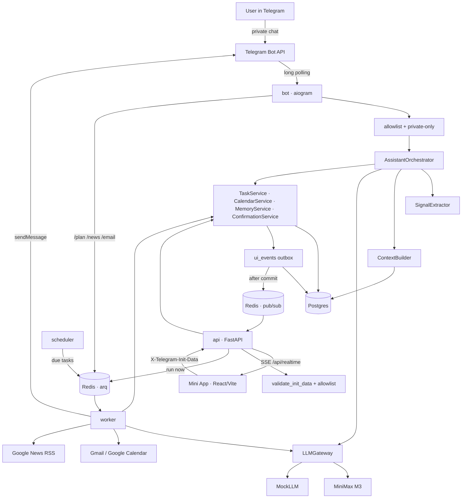
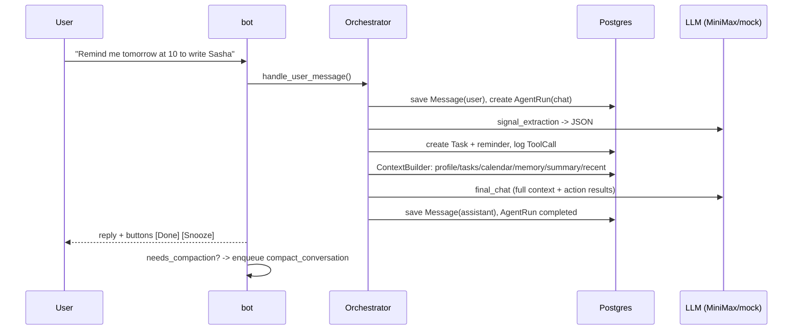
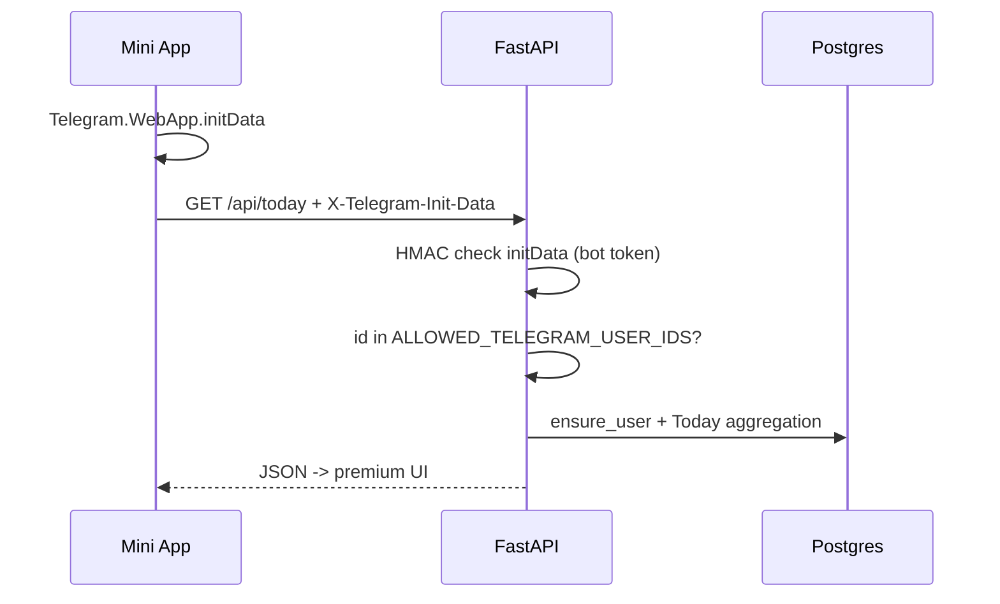
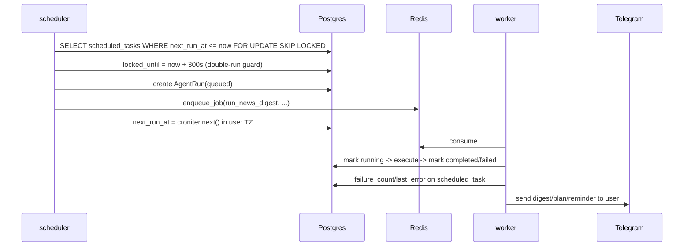

# Lumi Architecture

Core principle: **the LLM is stateless, the backend is stateful**. The model provider stores nothing; every call receives a freshly assembled context from Postgres. This makes the system portable across providers, debuggable, and cheaper to manage at the context layer.

## Services (Docker Compose)

| Service | Command | Purpose |
|---|---|---|
| `postgres` | postgres:16-alpine | source of truth: messages, tasks, memory, calendar, logs |
| `redis` | redis:7-alpine | arq queue and coordination |
| `api` | `uvicorn lumi.main:app` | Mini App REST API, initData validation, `/app` static files |
| `bot` | `python -m lumi.bot.runner` | aiogram long polling, commands, callbacks |
| `worker` | `python -m lumi.worker.main` | arq jobs: digests, triage, planning, sync, reminder cron, compaction |
| `scheduler` | `python -m lumi.scheduler.main` | every 30s: due `scheduled_tasks` -> queue |

All four Python processes use the same `lumi-backend` image: one build, different commands.

## System map



## Chat message flow



Key detail: extraction and the final reply are **two separate LLM calls**. Extraction returns strict JSON and can fail silently (chat still works); the final reply receives the list of already executed backend actions in context, so it does not invent them.

## Mini App flow



`Run now` endpoints (`plan-day`, `triage/run`, `digest/run`, `automations/{id}/run`) create an `agent_run`, **commit**, and enqueue a Redis job. The Mini App keeps a `GET /api/realtime` SSE stream open: the backend writes small `ui_events` inside the same transaction, publishes them to Redis only after commit, and the frontend invalidates React Query and refetches current REST endpoints. The older `GET /api/agent-runs/{id}` polling path remains as a fallback for user-started runs.

## Automation flow



Reminders are a separate arq cron in the worker, running every minute: `find_due_reminders()` across all users, Telegram delivery with buttons, and idempotency via `metadata.reminder_sent_at`.

## Code layers

```text
bot/api  ->  assistant/orchestrator  ->  services  ->  connectors / llm  ->  DB / external APIs
```

- `lumi/assistant/` - orchestrator, context_builder, signal_extractor, memory_service, compaction, prompts
- `lumi/services/` - tasks, calendar, planning, email, news, automations, confirmations, today, runs, audit, users, notifier
- `lumi/connectors/` - google (auth/gmail/calendar), news (rss)
- `lumi/llm/` - base protocol, minimax, mock, gateway (llm_calls logging), json_utils
- `lumi/security/` - telegram_auth (HMAC initData), crypto (Fernet)
- `lumi/api/` - deps (auth), routes/*, serializers, run_helper
- `lumi/bot/` - handlers, keyboards, formatting, runner
- `lumi/worker/`, `lumi/scheduler/` - background processing

Rule: bot handlers and API routes never call MiniMax/Gmail/Calendar directly; they go through services and connectors. Every agent action is a row in `tool_calls`, every model call is in `llm_calls`, and every run is in `agent_runs` (see Agent Runs in the Mini App).

## Agent run lifecycle

```text
queued -> running -> completed
                 -> failed (error_message, error_json)
```

`trigger`: `telegram_message` / `telegram_command` / `telegram_callback` / `scheduled_task` / `manual_api` / `system`.

## Confirmations (two-phase actions)

Risky or low-confidence actions are not executed immediately:

```text
SignalExtractor -> PendingConfirmation(pending) + [yes]/[no] buttons in Telegram
-> callback confirm:<id> -> ConfirmationExecutor -> action -> audit_log
```

Always require confirmation: writes to external Google Calendar, enabling automations, and tasks/memory below the confidence threshold. Email sending/deletion is not implemented at all by design.

## Extension points

| Today | Replacement | Where to change |
|---|---|---|
| MiniMax M3 | OpenAI/Anthropic/local | `lumi/llm/` - new provider behind `LLMProvider` |
| Gmail | Outlook | `lumi/connectors/` + `EmailService` |
| keyword memory | pgvector | `MemoryService.retrieve_relevant` |
| polling | webhook | `bot/runner.py` |
| no real-time | SSE + Redis fanout | `services/realtime.py`, `/api/realtime`, `ui_events` |
| local files | S3 | `files` table already exists |
