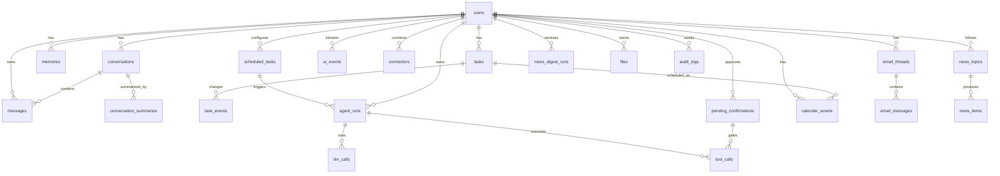

# Lumi Database

Postgres 16 · SQLAlchemy 2 async · Alembic. UUID keys, `timestamptz` everywhere, JSONB for metadata. Enums are stored as VARCHAR + CHECK constraints instead of native enums so they are easier to evolve. Models: `backend/src/lumi/db/models.py`; migrations: `backend/alembic/versions/`.

## ERD



## Tables

### Conversation core

| Table | Purpose | Written by | Read by |
|---|---|---|---|
| `users` | Telegram profile, timezone, English UI locale, settings | bot, api (ensure_user) | all |
| `conversations` | one `main` chat per user (partial unique index) | UserService | orchestrator, compaction |
| `messages` | all chat messages; `is_compacted` excludes rows from context | orchestrator | ContextBuilder, compaction, `/api/messages` |
| `conversation_summaries` | compacted history versions | CompactionService | ContextBuilder |

`conversations.summary_current_id` / `compacted_until_message_id` are UUIDs without foreign keys on purpose: this avoids a circular dependency with summaries/messages.

### Product entities

| Table | Key fields | Notes |
|---|---|---|
| `tasks` | status (inbox/active/done/cancelled), priority, due_at, reminder_at, snoozed_until, source, tags[] | `metadata.reminder_sent_at` provides reminder idempotency |
| `task_events` | event_type, before/after JSON, actor | full task change audit |
| `memories` | kind, importance 1-5, confidence, tags[], normalized_text | dedupe by keyword-overlap >= 0.75; conflict marked as `potential_conflict` |
| `calendar_events` | source (internal/google), status (confirmed/tentative/cancelled/proposed), busy | unique (user, source, ext_calendar, ext_event) where ext_event is not null |
| `email_threads` | category (8 types), importance, triage_status, summary | `metadata.task_candidate` is the task suggestion from triage |
| `email_messages` | snippet always; body_text only with `STORE_EMAIL_BODIES=true` | privacy by default |
| `news_topics` / `news_items` / `news_digest_runs` | item dedupe by `unique(user_id, hash)` (sha256 URL) | digest stores text + items_json |

### Automations and observability

| Table | Purpose |
|---|---|
| `scheduled_tasks` | cron + user TZ, `next_run_at` (partial index where enabled), `locked_until` double-run guard, failure_count |
| `agent_runs` | every agent run: type, status, trigger, summaries, error; `metadata.context_snapshot` for chat runs (debug) |
| `llm_calls` | provider/model/request_kind/latency/char+token estimates; raw prompts are NOT stored except with `STORE_LLM_DEBUG_PAYLOADS=true` |
| `tool_calls` | tool name, args/result JSON, requires_confirmation, confirmation link |
| `pending_confirmations` | action_type + payload + prompt; statuses pending/accepted/rejected/expired (48h TTL) |
| `ui_events` | durable outbox for Mini App SSE: topics/event_type/payload, catch-up by `(user_id, id)` |
| `connectors` | Google connection status, scopes, last_sync_at |
| `audit_logs` | actor/entity/action/details for every significant change |
| `files` | local file metadata; no S3 in the MVP |

## Indexes worth knowing

```text
uq_conversations_main_per_user   unique(user_id) WHERE kind='main'
ix_tasks_user_reminder           (user_id, reminder_at) WHERE reminder_at IS NOT NULL
ix_scheduled_tasks_next_run      (next_run_at) WHERE enabled = true
ix_ui_events_user_id             (user_id, id)
uq_calendar_events_external      unique(user,source,ext_cal,ext_event) WHERE ext_event IS NOT NULL
uq_news_items_user_hash          unique(user_id, hash)
GIN: memories.tags, tasks.tags, email_threads.labels
```

## Migrations

```bash
make migrate                      # alembic upgrade head
make revision m="add_something"   # autogenerate a new migration
```

Seed data (`make seed`): user from `ALLOWED_TELEGRAM_USER_IDS` and main conversation. News topics and automations are user-created in the Mini App.
