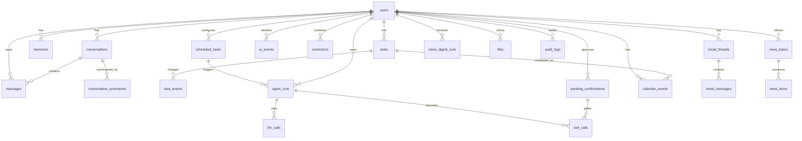

# База данных Lumi

Postgres 16 · SQLAlchemy 2 async · Alembic. UUID-ключи, `timestamptz` везде,
JSONB для метаданных. Enum'ы хранятся как VARCHAR + CHECK (без native enum —
проще эволюционировать). Модели: `backend/src/lumi/db/models.py`,
миграции: `backend/alembic/versions/`.

## ERD



## Таблицы

### Ядро диалога

| Таблица | Назначение | Пишут | Читают |
|---|---|---|---|
| `users` | Telegram-профиль, timezone, locale, settings | bot, api (ensure_user) | все |
| `conversations` | один `main`-чат на пользователя (partial unique index) | UserService | orchestrator, compaction |
| `messages` | вся переписка; `is_compacted` исключает из контекста | orchestrator | ContextBuilder, compaction, `/api/messages` |
| `conversation_summaries` | версии сжатой истории | CompactionService | ContextBuilder |

`conversations.summary_current_id` / `compacted_until_message_id` — UUID без FK
(намеренно: разрыв циклической зависимости с summaries/messages).

### Продуктовые сущности

| Таблица | Ключевые поля | Заметки |
|---|---|---|
| `tasks` | status (inbox/active/done/cancelled), priority, due_at, reminder_at, snoozed_until, source, tags[] | `metadata.reminder_sent_at` — идемпотентность напоминаний |
| `task_events` | event_type, before/after JSON, actor | полный аудит изменений задачи |
| `memories` | kind, importance 1–5, confidence, tags[], normalized_text | дедуп по keyword-overlap ≥ 0.75; конфликт помечается `potential_conflict` |
| `calendar_events` | source (internal/google), status (confirmed/tentative/cancelled/proposed), busy | unique (user, source, ext_calendar, ext_event) where ext_event not null |
| `email_threads` | category (8 типов), importance, triage_status, summary | `metadata.task_candidate` — предложение задачи из triage |
| `email_messages` | snippet всегда; body_text только при `STORE_EMAIL_BODIES=true` | приватность по умолчанию |
| `news_topics` / `news_items` / `news_digest_runs` | дедуп items по `unique(user_id, hash)` (sha256 URL) | digest хранит текст + items_json |

### Автоматизации и наблюдаемость

| Таблица | Назначение |
|---|---|
| `scheduled_tasks` | cron + TZ пользователя, `next_run_at` (partial index where enabled), `locked_until` против двойного запуска, failure_count |
| `agent_runs` | каждый запуск агента: type, status, trigger, summaries, error; `metadata.context_snapshot` для chat-ранов (debug) |
| `llm_calls` | provider/model/request_kind/latency/char+token estimates; сырые промпты НЕ хранятся (только при `STORE_LLM_DEBUG_PAYLOADS=true`) |
| `tool_calls` | имя инструмента, args/result JSON, requires_confirmation, ссылка на confirmation |
| `pending_confirmations` | action_type + payload + prompt; статусы pending/accepted/rejected/expired (TTL 48 ч) |
| `ui_events` | durable outbox для Mini App SSE: topics/event_type/payload, catch-up по `(user_id, id)` |
| `connectors` | статус Google-подключения, scopes, last_sync_at |
| `audit_logs` | actor/entity/action/details для всех значимых изменений |
| `files` | метаданные локальных файлов (S3 нет в MVP) |

## Индексы, на которые стоит обратить внимание

```text
uq_conversations_main_per_user   unique(user_id) WHERE kind='main'
ix_tasks_user_reminder           (user_id, reminder_at) WHERE reminder_at IS NOT NULL
ix_scheduled_tasks_next_run      (next_run_at) WHERE enabled = true
ix_ui_events_user_id             (user_id, id)
uq_calendar_events_external      unique(user,source,ext_cal,ext_event) WHERE ext_event IS NOT NULL
uq_news_items_user_hash          unique(user_id, hash)
GIN: memories.tags, tasks.tags, email_threads.labels
```

## Миграции

```bash
make migrate                      # alembic upgrade head
make revision m="add_something"   # автогенерация новой миграции
```

Сид-данные (`make seed`): пользователь из `ALLOWED_TELEGRAM_USER_IDS`, main conversation,
3 темы новостей, 4 автоматизации (выключены — включаются в Mini App).
