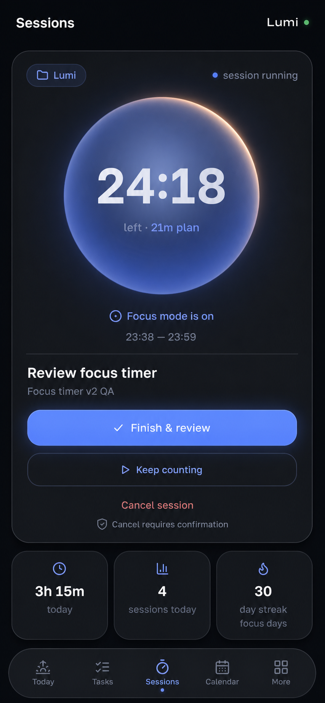
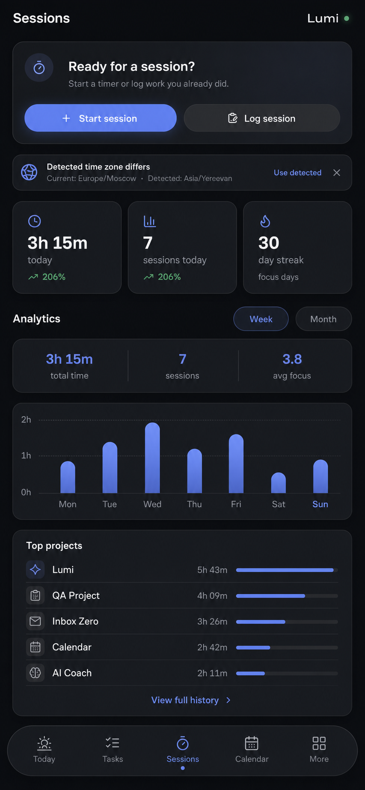
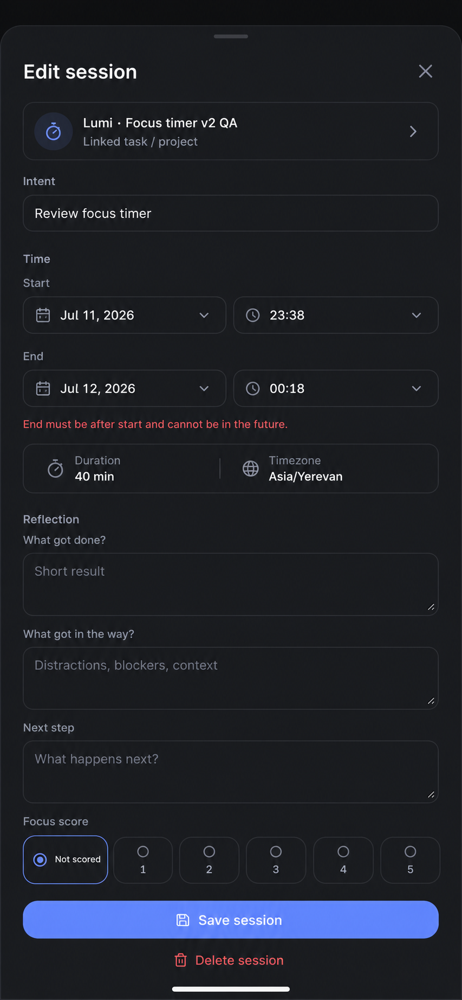

# Focus timer design direction

These mockups define the targeted Sessions update. They are design references,
not screenshots of the shipped implementation. The existing orb, palette, and
typographic hierarchy remain the visual foundation.

## Active and overtime

- The timer orb remains the dominant element.
- `Finish & review` is the only primary action.
- `Keep counting` is available when the planned time expires.
- `Cancel session` requires confirmation and never shares the primary visual
  weight.
- An edit icon must not finish an active session.

## Responsive overview and analytics

- The time-zone prompt reserves its own space and never covers analytics.
- Axis labels are derived from the same scale as the bars.
- The overview shows at most five projects; full exploration lives in History.
- The layout must not widen the document at 320, 375, 390, or 430 CSS pixels.

## Edit, log, and review

- Start and end each have independent date and time controls, including sessions
  that cross midnight.
- Focus score is nullable and `Not scored` is an explicit radio choice.
- Validation is inline and preserves the rest of the form layout.
- The save action remains reachable above the keyboard and safe-area inset.

## Interaction invariants

- Leaving the Sessions route must not stop timer tracking or the completion
  alarm.
- Finish and cancel are mutually exclusive state transitions.
- No-project is represented as `null` in data and localized only in the UI.
- History details are re-fetched by session id after mutations.
- Nested sheets expose exactly one modal layer to assistive technology.

## Implementation QA evidence

The following screenshots come from the isolated `lumi_focus_fix` runtime after
the implementation, with demo data loaded through the explicit local-only seed:

| Flow | Evidence |
| --- | --- |
| Route-safe overtime and explicit actions at 430 px | [Active/overtime](assets/focus-timer/qa/active-overtime-430.png) |
| Truthful month scale with all 31 days visible at 320 px | [Month chart](assets/focus-timer/qa/month-chart-320.png) |
| Separate start/end controls and nullable score at 430 px | [Edit session](assets/focus-timer/qa/edit-session-430.png) |
| Server-filtered, paginated history at 430 px | [Session history](assets/focus-timer/qa/history-430.png) |
