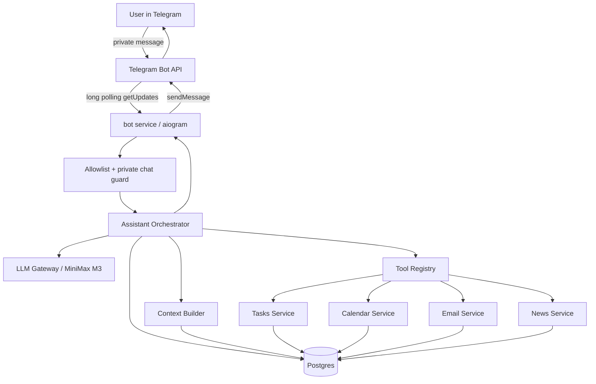
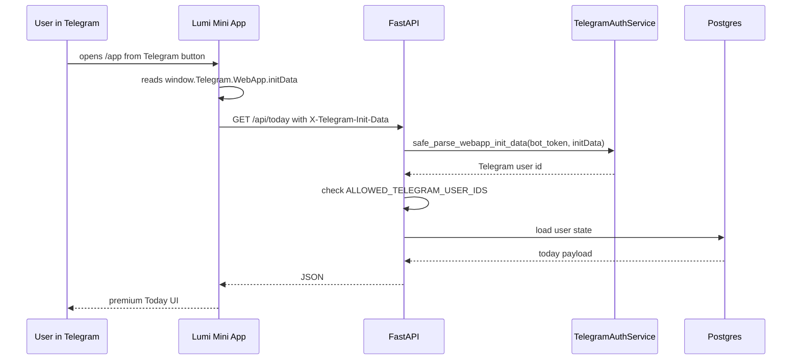
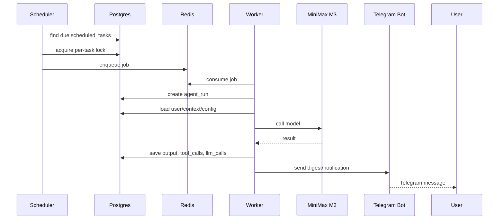
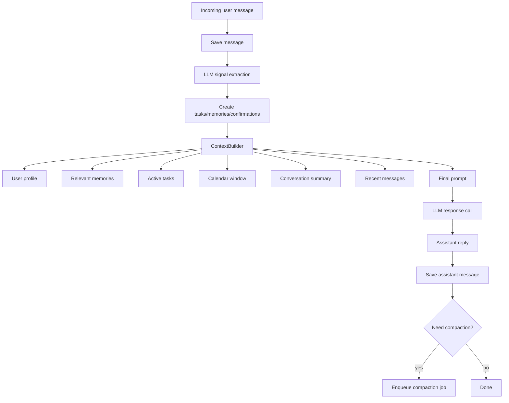

# Lumi — Architecture Spec

## Архитектурное решение MVP

Lumi должен быть локальным Docker Compose проектом, который можно запустить на Mac.

Главный принцип: **LLM stateless, stateful backend**.

То есть:

- Не использовать постоянный “chat id” на стороне LLM как источник правды.
- Не рассчитывать, что провайдер LLM хранит историю.
- Все сообщения, summaries, memories, tasks, calendar, email digest, agent runs хранятся в Postgres.
- Каждый вызов LLM получает контекст, который собрал backend `ContextBuilder`.
- Compaction делает backend: старые сообщения суммируются и заменяются summary внутри будущего контекста.

## Сервисы Docker Compose

Минимальная production-like локальная структура:

```text
lumi-assistant/
  backend/
  frontend/
  docs/
  scripts/
  docker-compose.yml
  Makefile
  .env.example
```

Docker services:

```text
postgres
redis
api
bot
worker
scheduler
```

Опционально для dev:

```text
frontend-dev
```

### postgres

Основная БД.

Хранит:

- users
- conversations
- messages
- summaries
- memories
- tasks
- reminders
- calendar events
- email metadata/digests
- news topics/items/digests
- scheduled tasks
- agent runs
- LLM calls
- tool calls
- pending confirmations
- connectors
- audit logs

### redis

Используется для:

- async job queue;
- locks;
- rate limiting;
- transient cache;
- idempotency keys;
- worker coordination.

### api

FastAPI backend.

Отвечает за:

- REST API для Mini App;
- Telegram Mini App initData validation;
- serving static Mini App build under `/app`;
- health checks;
- connector OAuth endpoints if implemented;
- admin/debug endpoints for local development.

### bot

Aiogram long polling process.

Отвечает за:

- получение Telegram updates через getUpdates/long polling;
- allowlist user check;
- private chat only;
- commands;
- callback buttons;
- передачу пользовательских сообщений в Assistant Orchestrator;
- отправку ответов, reminders, digests.

### worker

Async worker process.

Отвечает за:

- scheduled jobs execution;
- email triage;
- news digest;
- calendar sync;
- daily planning;
- conversation compaction;
- reminder notifications;
- long-running agent runs.

Рекомендуемая библиотека: `arq` + Redis, потому что backend Python async и много I/O calls. Если `arq` окажется неудобен, допустимо использовать Celery + Redis, но тогда нужно аккуратно задокументировать причину.

### scheduler

Process, который раз в N секунд:

1. читает `scheduled_tasks`, где `next_run_at <= now`;
2. ставит job в Redis queue;
3. берет lock, чтобы не было двойного запуска;
4. обновляет `last_run_at`, `next_run_at`, `failure_count`.

Рекомендуемые библиотеки:

- `croniter` для вычисления cron;
- простой async loop или APScheduler.

Не использовать системный cron внутри Mac как основной механизм. Всё должно жить внутри приложения.

## High-level runtime flow



## Mini App flow



## Scheduled task flow



## Context management flow



## Внутренние Python packages

Рекомендуемая структура backend:

```text
backend/
  pyproject.toml
  alembic.ini
  alembic/
  src/lumi/
    __init__.py
    main.py
    config.py
    logging.py
    db/
      base.py
      session.py
      models.py
      repositories/
    bot/
      runner.py
      handlers.py
      keyboards.py
      formatting.py
    api/
      router.py
      deps.py
      routes/
        me.py
        today.py
        tasks.py
        calendar.py
        inbox.py
        news.py
        automations.py
        memory.py
        agent_runs.py
        connectors.py
        debug.py
    assistant/
      orchestrator.py
      context_builder.py
      prompts.py
      signal_extractor.py
      compaction.py
      memory_service.py
      task_extractor.py
    llm/
      base.py
      minimax.py
      mock.py
      json_utils.py
    tools/
      registry.py
      schemas.py
      task_tools.py
      calendar_tools.py
      email_tools.py
      news_tools.py
    services/
      tasks.py
      reminders.py
      calendar.py
      email.py
      news.py
      automations.py
      today.py
      confirmations.py
      audit.py
    connectors/
      google/
        auth.py
        gmail.py
        calendar.py
      news/
        rss.py
    worker/
      main.py
      jobs.py
    scheduler/
      main.py
    security/
      telegram_auth.py
      crypto.py
      permissions.py
    utils/
      time.py
      text.py
      ids.py
```

## Frontend structure

```text
frontend/
  package.json
  index.html
  vite.config.ts
  tailwind.config.ts
  src/
    main.tsx
    App.tsx
    api/client.ts
    telegram/webapp.ts
    routes/
      TodayPage.tsx
      TasksPage.tsx
      CalendarPage.tsx
      InboxPage.tsx
      NewsPage.tsx
      AutomationsPage.tsx
      MemoryPage.tsx
      SettingsPage.tsx
    components/
      layout/
      cards/
      timeline/
      task/
      calendar/
      inbox/
      motion/
    styles/
      globals.css
      tokens.css
```

## Важное архитектурное правило

Ни один модуль не должен напрямую дергать MiniMax, Telegram, Gmail или Google Calendar без service/connector abstraction.

Правильно:

```text
AssistantOrchestrator -> LLMGateway -> MiniMaxProvider
CalendarService -> CalendarConnector -> GoogleCalendarClient
EmailService -> EmailConnector -> GmailClient
Bot handler -> AssistantOrchestrator
```

Неправильно:

```text
bot handler directly calls minimax
bot handler directly writes many tables
frontend directly calls Google APIs
LLM decides destructive action without backend confirmation
```

## Agent run lifecycle

Every AI/background operation should be traceable:

```text
created -> running -> waiting_confirmation -> completed
                       -> failed
                       -> cancelled
```

`agent_runs` should include:

- type;
- trigger;
- status;
- input summary;
- result summary;
- error;
- timestamps;
- related scheduled task id;
- related message id if run came from chat.

## Tool call lifecycle

Even if provider-native tool calling is not implemented, backend actions must be logged as tool calls:

```text
planned -> executed -> completed
        -> failed
        -> requires_confirmation
        -> skipped
```

This gives observability and auditability.

## Local-first assumptions

- Single user for MVP.
- One Telegram ID allowlisted.
- One main conversation.
- Local Postgres volume.
- Local Redis.
- Local files under `./data/files`.
- Mini App served by FastAPI static files.
- HTTPS tunnel optional for real iPad/Telegram Mini App.

## Future expansion points

Implement abstractions now so future changes are easy:

- `LLMProvider`: MiniMax -> OpenAI/Anthropic/OpenRouter/local.
- `EmailConnector`: Gmail -> Outlook.
- `CalendarConnector`: Google -> Microsoft.
- `FileStorage`: local -> S3.
- `MemoryRetriever`: keyword -> vector/pgvector.
- `BotTransport`: Telegram polling -> webhook.
- `AuthProvider`: Telegram-only -> multi-user OAuth.
