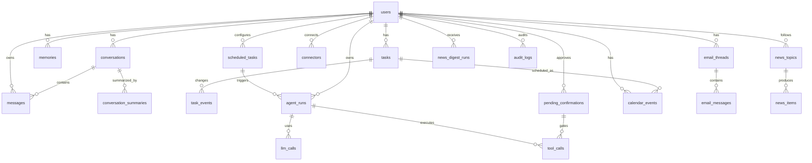

# Lumi — Database Schema Spec

Use Postgres + SQLAlchemy 2 async + Alembic migrations.

All IDs should be UUID unless noted.

Use timezone-aware `timestamptz` for all timestamps.

Use JSONB for flexible metadata/config, but not instead of important queryable fields.

## Enums

Create Python enums and Postgres enum types where appropriate.

```text
message_role: user, assistant, system, tool
conversation_kind: main, system, scheduled, debug
memory_kind: preference, fact, project, instruction, contact, workflow, other
memory_status: active, archived, rejected
 task_status: inbox, active, done, cancelled
priority: low, medium, high, urgent
scheduled_task_type: news_digest, email_triage, daily_planning, calendar_sync, task_review, custom_prompt
agent_run_type: chat, news_digest, email_triage, daily_planning, calendar_sync, task_review, reminder, compaction, custom
run_status: queued, running, waiting_confirmation, completed, failed, cancelled
confirmation_status: pending, accepted, rejected, expired
calendar_source: internal, google
calendar_event_status: confirmed, tentative, cancelled, proposed
email_category: needs_reply, waiting_for_me, decision_needed, fyi, newsletter, invoice_document, ignore, unknown
connector_type: google
connector_status: disconnected, connected, error, needs_reauth
```

## users

Represents one Telegram user. MVP supports one allowlisted user but schema should allow more later.

Fields:

```text
id uuid pk
telegram_user_id bigint unique not null
telegram_chat_id bigint null
username text null
first_name text null
last_name text null
language_code text null
timezone text not null default 'Europe/Moscow'
locale text not null default 'ru'
settings jsonb not null default '{}'
created_at timestamptz not null
updated_at timestamptz not null
last_seen_at timestamptz null
```

Indexes:

```text
unique telegram_user_id
```

## conversations

One main conversation for MVP.

Fields:

```text
id uuid pk
user_id uuid fk users.id not null
kind conversation_kind not null default 'main'
title text not null default 'Lumi'
status text not null default 'active'
summary_current_id uuid null
compacted_until_message_id uuid null
metadata jsonb not null default '{}'
created_at timestamptz not null
updated_at timestamptz not null
```

Indexes:

```text
(user_id, kind)
```

Constraint:

```text
For MVP, enforce one main conversation per user via partial unique index:
unique (user_id) where kind = 'main'
```

## messages

Stores chat messages and tool/system messages.

Fields:

```text
id uuid pk
conversation_id uuid fk conversations.id not null
user_id uuid fk users.id not null
role message_role not null
content text not null
content_json jsonb null
telegram_message_id bigint null
telegram_chat_id bigint null
token_estimate int null
char_count int not null default 0
is_compacted boolean not null default false
metadata jsonb not null default '{}'
created_at timestamptz not null
```

Indexes:

```text
(conversation_id, created_at)
(user_id, created_at)
telegram_message_id where telegram_message_id is not null
```

## conversation_summaries

Compacted old messages.

Fields:

```text
id uuid pk
conversation_id uuid fk conversations.id not null
user_id uuid fk users.id not null
summary_text text not null
from_message_id uuid fk messages.id null
to_message_id uuid fk messages.id null
message_count int not null default 0
token_estimate int null
version int not null default 1
metadata jsonb not null default '{}'
created_at timestamptz not null
```

Indexes:

```text
(conversation_id, created_at desc)
```

## memories

Long-term memory. Must be visible/editable in Mini App.

Fields:

```text
id uuid pk
user_id uuid fk users.id not null
kind memory_kind not null
status memory_status not null default 'active'
text text not null
normalized_text text null
tags text[] not null default '{}'
importance int not null default 3 -- 1..5
confidence numeric(3,2) not null default 0.80
source_message_id uuid fk messages.id null
source_agent_run_id uuid fk agent_runs.id null
last_accessed_at timestamptz null
created_at timestamptz not null
updated_at timestamptz not null
metadata jsonb not null default '{}'
```

Indexes:

```text
(user_id, status, importance desc)
(user_id, kind)
GIN(tags)
GIN(to_tsvector('simple', text)) optional
```

Rules:

- Do not store highly sensitive data unless user explicitly asks.
- Deduplicate similar memory texts.
- Store memory source.
- Allow archive/delete from Mini App.

## tasks

Fields:

```text
id uuid pk
user_id uuid fk users.id not null
title text not null
description text null
status task_status not null default 'active'
priority priority not null default 'medium'
project text null
tags text[] not null default '{}'
due_at timestamptz null
reminder_at timestamptz null
snoozed_until timestamptz null
source text not null default 'manual' -- chat/email/agent/manual/calendar
source_ref_type text null
source_ref_id uuid null
source_message_id uuid fk messages.id null
calendar_event_id uuid null
created_by text not null default 'user' -- user/agent/system
completed_at timestamptz null
created_at timestamptz not null
updated_at timestamptz not null
metadata jsonb not null default '{}'
```

Indexes:

```text
(user_id, status, due_at)
(user_id, reminder_at) where reminder_at is not null
GIN(tags)
```

## task_events

Audit trail for task changes.

Fields:

```text
id uuid pk
task_id uuid fk tasks.id not null
user_id uuid fk users.id not null
event_type text not null
before_json jsonb null
after_json jsonb null
actor text not null -- user/agent/system
agent_run_id uuid fk agent_runs.id null
created_at timestamptz not null
```

## scheduled_tasks

User automations.

Fields:

```text
id uuid pk
user_id uuid fk users.id not null
type scheduled_task_type not null
title text not null
cron_expression text not null
timezone text not null
config jsonb not null default '{}'
enabled boolean not null default true
last_run_at timestamptz null
next_run_at timestamptz null
locked_until timestamptz null
failure_count int not null default 0
last_error text null
created_at timestamptz not null
updated_at timestamptz not null
```

Indexes:

```text
(user_id, enabled, next_run_at)
(next_run_at) where enabled = true
```

## agent_runs

Every agent operation.

Fields:

```text
id uuid pk
user_id uuid fk users.id not null
type agent_run_type not null
status run_status not null default 'queued'
trigger text not null -- telegram_message/scheduled_task/manual_api/system
scheduled_task_id uuid fk scheduled_tasks.id null
conversation_id uuid fk conversations.id null
source_message_id uuid fk messages.id null
input_summary text null
result_summary text null
error_message text null
error_json jsonb null
started_at timestamptz null
finished_at timestamptz null
created_at timestamptz not null
updated_at timestamptz not null
metadata jsonb not null default '{}'
```

Indexes:

```text
(user_id, created_at desc)
(user_id, type, created_at desc)
(status, created_at)
```

## llm_calls

Observability and cost estimation.

Fields:

```text
id uuid pk
agent_run_id uuid fk agent_runs.id null
user_id uuid fk users.id null
provider text not null
model text not null
request_kind text not null
status text not null -- success/error/timeout
input_char_count int null
output_char_count int null
input_token_estimate int null
output_token_estimate int null
latency_ms int null
request_hash text null
error_message text null
metadata jsonb not null default '{}'
created_at timestamptz not null
```

Do not store raw API key or full raw provider response if it may contain sensitive data. Raw prompts may be stored only in local dev if `STORE_LLM_DEBUG_PAYLOADS=true`.

## tool_calls

Fields:

```text
id uuid pk
agent_run_id uuid fk agent_runs.id not null
user_id uuid fk users.id not null
tool_name text not null
status text not null -- planned/executed/completed/failed/requires_confirmation/skipped
args_json jsonb not null default '{}'
result_json jsonb null
error_message text null
requires_confirmation boolean not null default false
confirmation_id uuid fk pending_confirmations.id null
started_at timestamptz null
finished_at timestamptz null
created_at timestamptz not null
```

Indexes:

```text
(agent_run_id, created_at)
(user_id, tool_name, created_at desc)
```

## pending_confirmations

For actions requiring explicit user confirmation.

Fields:

```text
id uuid pk
user_id uuid fk users.id not null
action_type text not null
action_payload jsonb not null
prompt text not null
status confirmation_status not null default 'pending'
telegram_message_id bigint null
expires_at timestamptz null
decided_at timestamptz null
created_at timestamptz not null
updated_at timestamptz not null
metadata jsonb not null default '{}'
```

Indexes:

```text
(user_id, status, created_at desc)
```

## calendar_events

Internal and synced external calendar events.

Fields:

```text
id uuid pk
user_id uuid fk users.id not null
source calendar_source not null
external_calendar_id text null
external_event_id text null
title text not null
description text null
start_at timestamptz not null
end_at timestamptz not null
timezone text not null
all_day boolean not null default false
busy boolean not null default true
status calendar_event_status not null default 'confirmed'
created_by text not null default 'user' -- user/agent/external_sync
source_task_id uuid fk tasks.id null
agent_run_id uuid fk agent_runs.id null
last_synced_at timestamptz null
metadata jsonb not null default '{}'
created_at timestamptz not null
updated_at timestamptz not null
```

Indexes:

```text
(user_id, start_at, end_at)
(user_id, source, external_event_id)
```

Unique nullable:

```text
unique(user_id, source, external_calendar_id, external_event_id) where external_event_id is not null
```

## connectors

OAuth/connectors status.

Fields:

```text
id uuid pk
user_id uuid fk users.id not null
type connector_type not null
status connector_status not null default 'disconnected'
scopes text[] not null default '{}'
credentials_encrypted text null
credentials_file_path text null
last_sync_at timestamptz null
last_error text null
metadata jsonb not null default '{}'
created_at timestamptz not null
updated_at timestamptz not null
```

Indexes:

```text
unique(user_id, type)
```

## email_threads

Fields:

```text
id uuid pk
user_id uuid fk users.id not null
provider text not null default 'google'
external_thread_id text not null
subject text null
participants jsonb not null default '[]'
labels text[] not null default '{}'
last_message_at timestamptz null
snippet text null
category email_category not null default 'unknown'
importance int not null default 3
triage_status text not null default 'new'
summary text null
metadata jsonb not null default '{}'
created_at timestamptz not null
updated_at timestamptz not null
```

Indexes:

```text
unique(user_id, provider, external_thread_id)
(user_id, last_message_at desc)
(user_id, category)
GIN(labels)
```

## email_messages

Fields:

```text
id uuid pk
thread_id uuid fk email_threads.id not null
user_id uuid fk users.id not null
provider text not null default 'google'
external_message_id text not null
sender text null
recipients jsonb not null default '[]'
cc jsonb not null default '[]'
subject text null
snippet text null
body_text text null -- optional; can be null if STORE_EMAIL_BODIES=false
date_at timestamptz null
metadata jsonb not null default '{}'
created_at timestamptz not null
```

Indexes:

```text
unique(user_id, provider, external_message_id)
(thread_id, date_at)
```

Privacy default:

- Store snippets and summaries by default.
- Store bodies only if `STORE_EMAIL_BODIES=true`, default false.
- For triage, body can be fetched, summarized, then discarded.

## news_topics

Fields:

```text
id uuid pk
user_id uuid fk users.id not null
title text not null
query text not null
language text not null default 'ru'
enabled boolean not null default true
config jsonb not null default '{}'
created_at timestamptz not null
updated_at timestamptz not null
```

Indexes:

```text
(user_id, enabled)
```

## news_items

Fields:

```text
id uuid pk
user_id uuid fk users.id not null
topic_id uuid fk news_topics.id null
title text not null
url text not null
source_name text null
published_at timestamptz null
snippet text null
content_summary text null
hash text not null
metadata jsonb not null default '{}'
created_at timestamptz not null
```

Indexes:

```text
unique(user_id, hash)
(user_id, published_at desc)
(topic_id, published_at desc)
```

## news_digest_runs

Fields:

```text
id uuid pk
user_id uuid fk users.id not null
agent_run_id uuid fk agent_runs.id null
title text not null
digest_text text not null
items_json jsonb not null default '[]'
created_at timestamptz not null
```

## files

Local files metadata. No S3 in MVP.

Fields:

```text
id uuid pk
user_id uuid fk users.id not null
kind text not null
file_name text not null
mime_type text null
local_path text not null
size_bytes bigint null
metadata jsonb not null default '{}'
created_at timestamptz not null
```

## audit_logs

Fields:

```text
id uuid pk
user_id uuid fk users.id null
actor text not null -- user/agent/system
entity_type text not null
entity_id uuid null
action text not null
details jsonb not null default '{}'
created_at timestamptz not null
```

## ERD diagram

The implementation should include this Mermaid ERD in `docs/architecture.md`, adjusted to actual models:



## Migration requirements

Create Alembic migration for initial schema.

Include seed script:

- create user from Telegram user id if env provided;
- create main conversation;
- create default news topics;
- create default automations disabled or enabled based on env.

## Repository requirements

Use repository pattern or clean service-layer DB access. Do not put raw SQL everywhere unless justified.

Each repository should accept `AsyncSession`.

Example:

```python
class TaskRepository:
    def __init__(self, session: AsyncSession):
        self.session = session
```
