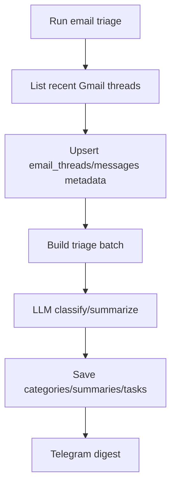
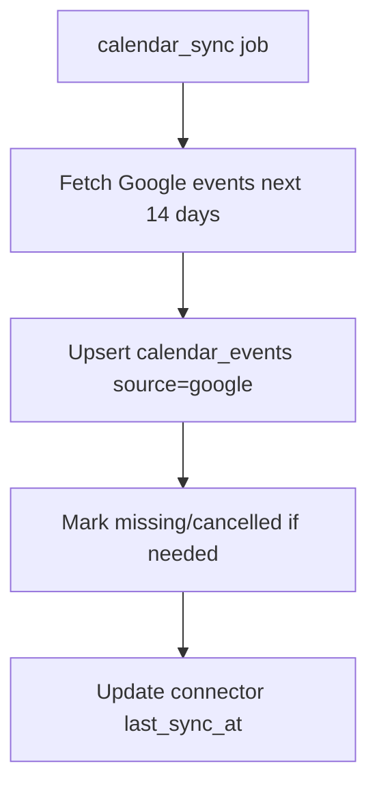
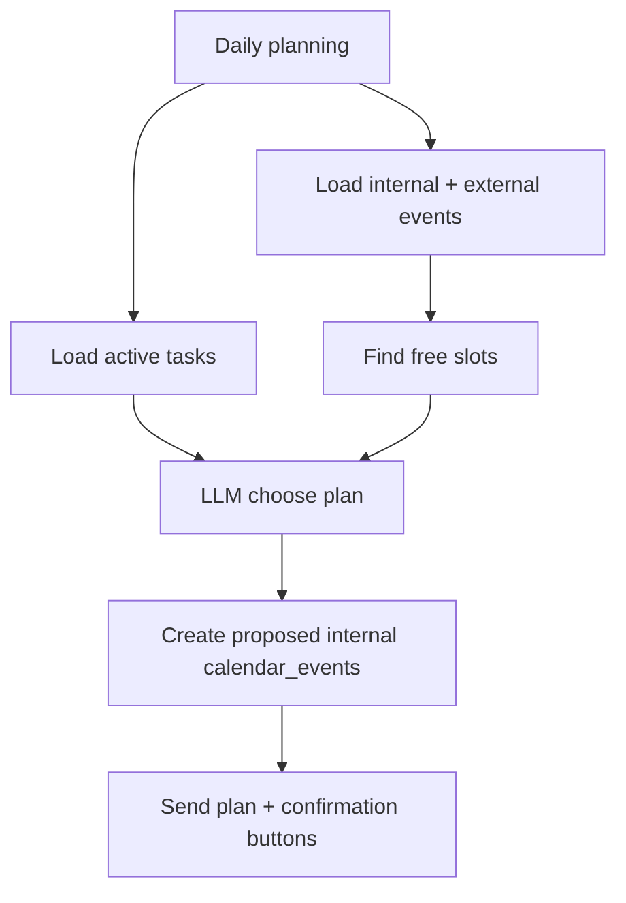

# Lumi — Connectors Spec

## Connector principles

Connectors must be isolated behind service interfaces.

Assistant/LLM should never directly call external APIs. Backend tools/services call connectors, log results, and pass summarized data to LLM.

## Connectors in MVP

1. Google Gmail
2. Google Calendar
3. RSS/News

Microsoft/Outlook is out of MVP but architecture should allow it later.

## Google OAuth strategy

MVP should support a local-friendly OAuth setup.

Implement at least one of these flows, preferably both:

### Option A — local CLI OAuth, recommended MVP fallback

Command:

```text
make google-auth-local
```

Behavior:

1. Reads `GOOGLE_OAUTH_CLIENT_SECRET_FILE`.
2. Uses `google_auth_oauthlib.flow.InstalledAppFlow`.
3. Opens browser locally.
4. User grants scopes.
5. Saves token securely to `./data/secrets/google_token.json` or encrypted DB field.
6. App uses token for Gmail/Calendar.

Pros:

- Easy for local testing.
- No public redirect URI required.
- Works before Mini App OAuth UI is polished.

Cons:

- Not production-grade.
- Host/browser/Docker path needs care.

### Option B — server OAuth via FastAPI redirect, optional but useful

Endpoints:

```text
GET /api/connectors/google/auth-url
GET /api/connectors/google/callback
```

Flow:

1. User opens Settings → Connect Google.
2. Frontend calls auth-url.
3. Backend returns Google OAuth authorization URL.
4. User grants access.
5. Google redirects to `APP_PUBLIC_URL/api/connectors/google/callback`.
6. Backend exchanges code for tokens.
7. Tokens encrypted and saved in connectors table.
8. Mini App shows connected status.

This requires stable HTTPS redirect URL; for local iPad testing use tunnel URL.

## Google scopes

MVP scopes:

```text
https://www.googleapis.com/auth/gmail.readonly
https://www.googleapis.com/auth/calendar.readonly
https://www.googleapis.com/auth/calendar.events
```

Rationale:

- Gmail read-only for triage.
- Calendar read-only for sync/free-busy.
- Calendar events for optional confirmed external event creation.

If Google marks Gmail scopes as sensitive/restricted, document setup steps clearly. For local personal testing, user can run app in test mode and add own Google account as test user.

## Token storage

Local MVP acceptable:

```text
./data/secrets/google_token.json
```

Better:

- encrypt with Fernet using `ENCRYPTION_KEY`;
- store encrypted token JSON in `connectors.credentials_encrypted`.

Do not print tokens in logs.

## Gmail connector

Class:

```python
class GmailConnector:
    async def list_recent_threads(self, user, since: datetime, max_results: int = 50) -> list[EmailThreadDTO]: ...
    async def get_thread_messages(self, user, thread_id: str) -> list[EmailMessageDTO]: ...
```

Because Google API Python client is sync, either:

- call it in threadpool via `asyncio.to_thread`; or
- keep connector sync and wrap at service boundary.

### Gmail triage flow



### Data minimization

Default:

- Store subject, snippet, metadata, classification, summary.
- Do not store full body unless `STORE_EMAIL_BODIES=true`.
- Fetch full message body only for triage, then summarize and discard.

### Email triage prompt

```text
Ты модуль triage почты для Lumi.
Тебе передан список писем/тредов. Сгруппируй их по важности и действию.
Не выдумывай содержимое писем.
Верни JSON:
{
  "summary": "короткая выжимка",
  "threads": [
    {
      "external_thread_id": "...",
      "category": "needs_reply|waiting_for_me|decision_needed|fyi|newsletter|invoice_document|ignore|unknown",
      "importance": 1-5,
      "reason": "почему важно",
      "suggested_action": "что сделать",
      "task_candidate": {"title": "...", "due_at_local": null, "priority": "medium"} | null
    }
  ],
  "telegram_digest": "готовый текст для пользователя"
}
```
```

### Telegram email digest format

```text
Почта за утро: 34 письма.

Важно:
1. Иван ждет подтверждения встречи до 14:00.
2. Finance прислали invoice.
3. Клиент ответил по договору.

Нашел задачи:
- Ответить Ивану
- Проверить invoice
- Дать комментарии по договору

[Создать задачи] [Открыть Inbox]
```

For MVP, `Создать задачи` can create tasks from high-confidence task candidates or create pending confirmations.

## Google Calendar connector

Class:

```python
class GoogleCalendarConnector:
    async def list_events(self, user, start: datetime, end: datetime) -> list[CalendarEventDTO]: ...
    async def create_event(self, user, event: CalendarEventCreateDTO) -> ExternalEventRef: ...
```

### Calendar sync flow



### Planning flow



### Free slot algorithm MVP

Input:

- day start/end from user settings, default 09:00–19:00;
- busy events from calendar;
- tasks with due date/priority;
- minimum slot duration;
- buffer between meetings default 10 minutes.

Algorithm:

1. Build sorted busy intervals.
2. Merge overlapping intervals.
3. Subtract from working day interval.
4. Filter free intervals >= required duration.
5. Score slots:
   - earlier for urgent tasks;
   - avoid lunch if configured;
   - prefer longer uninterrupted blocks for deep work.

### External calendar writes

External writes always require confirmation.

Process:

1. Create proposed internal event with `status=proposed`.
2. Create `pending_confirmation` action `create_google_calendar_event`.
3. Telegram button “Добавить в Google Calendar”.
4. On confirmation, call Google Calendar API.
5. Update internal event `source=google` or store external ids.
6. Audit log.

## Internal calendar

Even without Google connected, Lumi must work with internal calendar.

Internal events:

- focus blocks;
- reminders;
- user-created events;
- proposed plans.

Internal events appear in Mini App Calendar.

## News connector

MVP source: RSS.

Use `feedparser`.

Default strategy:

- For each `news_topic.query`, build Google News RSS search URL or use configured RSS URLs.
- Fetch max N items per topic.
- Deduplicate by URL hash.
- Store items.
- Summarize with LLM.

### Config examples

```json
{
  "topics": [
    {"title": "AI agents", "query": "AI agents OR autonomous agents"},
    {"title": "Telegram Mini Apps", "query": "Telegram Mini Apps Bot API"},
    {"title": "LLM pricing", "query": "LLM pricing API MiniMax OpenAI Anthropic"}
  ],
  "max_items_per_topic": 10,
  "language": "ru",
  "digest_style": "executive_brief"
}
```

### News digest prompt

```text
Ты модуль новостной выжимки Lumi.
Тебе переданы новости по темам пользователя.
Сделай короткий полезный digest на русском.
Не выдумывай факты за пределами заголовка/описания/извлеченного текста.
Группируй по темам.
Для каждой темы дай:
- что произошло;
- почему это важно пользователю;
- что можно сделать/проверить.
```

Output:

```text
Главное за утро

1. AI agents
— ...

2. Telegram Mini Apps
— ...

3. LLM pricing
— ...

Что стоит сделать:
- ...
```

## Tool registry

Create backend tool registry, even if not using provider-native tool calls.

Tools:

```text
create_task
update_task
complete_task
create_reminder
find_free_calendar_slots
create_internal_calendar_block
request_external_calendar_confirmation
run_email_triage
run_news_digest
create_news_topic
create_scheduled_task
store_memory
archive_memory
```

Each tool has:

- name;
- description;
- input Pydantic schema;
- permission level;
- requires_confirmation bool/function;
- executor function;
- audit logging.

## Permissions matrix

| Tool | Auto allowed | Confirmation required |
|---|---:|---:|
| create_task | yes if clear | if low confidence |
| complete_task | yes if user explicitly says | if ambiguous |
| create_reminder | yes if clear | if ambiguous |
| store_memory | yes only explicit/high confidence | otherwise yes |
| create_internal_calendar_block | yes if user explicitly asks | if ambiguous |
| create_external_calendar_event | no | always |
| email_read_triage | yes | no, if connector already authorized |
| email_send | no | always; can be not implemented |
| email_archive/delete | no | always; not MVP |
| news_digest | yes | no |
| create_automation | no enabled by default | confirmation to enable |

## Connector status in Mini App

Settings page should show:

```text
Google: connected/disconnected/needs reauth
Gmail: available/unavailable
Calendar: available/unavailable
Last sync: ...
Scopes: ...
```

If disconnected, show setup instructions.

## Failure behavior

- Gmail unavailable: show “Google connector не подключен”.
- Calendar unavailable: Lumi still uses internal calendar.
- News RSS fetch fails: skip source, include warning in agent_run, digest with available items.
- LLM fails during triage/digest: save failed run, do not crash worker.
