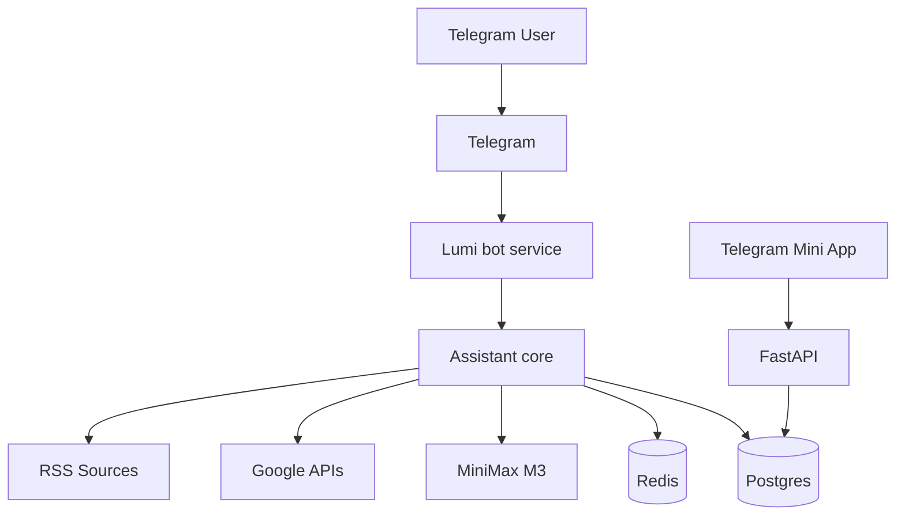

# Post-Implementation Prompt for Claude Code — Generate Lumi Architecture Documentation

Use this prompt after the Lumi project has been implemented and runs locally.

---

You are Claude Code working as a senior backend architect and technical documentation engineer.

The Lumi project has already been implemented. Your task now is **not** to build features, but to inspect the actual codebase and generate a complete architecture explanation for a backend developer who wants to understand and modify the system confidently.

The user is a backend developer. They want to understand:

- how the app is structured;
- how requests flow;
- how Telegram bot works;
- how Mini App auth works;
- how context management works;
- how messages are stored;
- how conversation summaries are produced;
- how memories are retrieved;
- how tasks are extracted from user messages;
- how scheduler/worker jobs run;
- how connectors work;
- how MiniMax is called;
- how the DB schema is connected;
- how to debug and modify the system.

## Required output

Generate these files in `docs/generated/`:

```text
docs/generated/LUMI_ARCHITECTURE_EXPLAINED.md
docs/generated/LUMI_ARCHITECTURE_EXPLAINED.html
docs/generated/database_schema.md
docs/generated/backend_code_map.md
docs/generated/context_management_deep_dive.md
docs/generated/connectors_deep_dive.md
docs/generated/scheduler_worker_deep_dive.md
docs/generated/local_runbook.md
docs/generated/diagrams/*.mmd
```

If possible, also generate:

```text
docs/generated/LUMI_ARCHITECTURE_EXPLAINED.pdf
```

PDF is optional. HTML and Markdown are mandatory.

## Documentation style

The HTML document should be visual, elegant, readable on iPad, and mostly static. Do not rely on complex JavaScript navigation that can break in Telegram/iPad WebView.

Use:

- clean typography;
- table of contents;
- cards;
- callouts;
- Mermaid diagrams or pre-rendered SVG diagrams;
- DB tables;
- sequence diagrams;
- code path maps;
- clear “where to change X” sections.

The Markdown should be complete even without HTML.

## Important: inspect actual code

Do not hallucinate architecture from the original plan. Inspect the implemented files.

Run commands as needed:

```text
find . -maxdepth 4 -type f
cat README.md
cat docker-compose.yml
cat .env.example
find backend -type f
find frontend -type f
find docs -type f
```

Inspect:

- SQLAlchemy models;
- Alembic migrations;
- FastAPI routes;
- bot handlers;
- services;
- LLM provider;
- context builder;
- worker jobs;
- scheduler;
- connectors;
- frontend API client and pages.

## Main architecture document structure

`LUMI_ARCHITECTURE_EXPLAINED.md/html` must include:

1. Executive overview
2. Runtime services map
3. Docker Compose topology
4. Request flows
5. Telegram bot lifecycle
6. Mini App lifecycle
7. Authentication and authorization
8. Database schema overview
9. Detailed DB table reference
10. Context management deep dive
11. Conversation compaction deep dive
12. Memory storage/retrieval deep dive
13. Task extraction flow
14. Reminder flow
15. Calendar flow
16. Gmail/email triage flow
17. News digest flow
18. Scheduler/worker flow
19. LLM provider flow
20. Tool registry/actions/confirmations
21. Error handling and retries
22. Security/privacy model
23. Local deployment and runbook
24. Debugging guide
25. How to modify common things
26. Known limitations / future improvements

## Required diagrams

Generate Mermaid diagrams for at least:

### 1. System context



Adjust to actual implementation.

### 2. Docker Compose topology

Show containers and ports.

### 3. Telegram message sequence

User sends message → bot → orchestrator → DB → context builder → LLM → tasks/memory → response.

### 4. Mini App API auth sequence

Mini App initData → FastAPI validation → user allowlist → API response.

### 5. Context builder flow

Profile/tasks/calendar/memory/summary/recent messages → prompt.

### 6. Compaction flow

Old messages → summary prompt → conversation_summaries → compacted markers.

### 7. Task extraction flow

Message → signal extractor → JSON → TaskService → DB → Telegram confirmation/response.

### 8. Scheduler worker flow

scheduled_tasks → scheduler → Redis → worker → agent_run → result.

### 9. DB ERD

Use actual tables/fields. Include relationships.

### 10. Connector flows

Google OAuth, Gmail triage, Calendar sync, News digest.

## Database schema documentation

Generate `database_schema.md` with for each table:

```text
Table name
Purpose
Fields with type/nullability/default
Indexes/constraints
Relationships
Who writes it
Who reads it
Lifecycle notes
Privacy notes
```

Also generate ERD.

## Backend code map

Generate `backend_code_map.md`:

For each important module:

```text
Path: backend/src/lumi/...
Purpose:
Key classes/functions:
Called by:
Calls:
How to modify:
```

Include:

- bot handlers;
- API routes;
- orchestrator;
- context builder;
- LLM provider;
- services;
- repositories;
- connectors;
- worker;
- scheduler;
- security.

## Context management deep dive

Generate a deep explanation of:

- why LLM calls are stateless;
- where raw messages are stored;
- what goes into context;
- how token/char budget works;
- how summaries are created;
- how memories are extracted;
- how memories are retrieved;
- how active tasks/calendar/email/news state enters prompt;
- where to change prompts;
- where to change thresholds;
- how to debug final context.

Include a concrete example:

```text
User writes: “Напомни завтра в 10 написать Саше”
```

Show:

- DB writes;
- signal extraction JSON;
- task row;
- context snapshot;
- final model call;
- assistant reply.

## Connectors deep dive

Explain:

- Google OAuth/token storage;
- Gmail read flow;
- email triage prompt;
- Calendar sync;
- internal vs external calendar;
- RSS news flow;
- how to add Microsoft Outlook later.

## Scheduler/worker deep dive

Explain:

- scheduled_tasks table;
- cron expressions;
- scheduler loop;
- Redis queue;
- worker job functions;
- agent_runs/tool_calls logging;
- retry/failure behavior;
- how to manually run a job;
- how to add new automation.

## Local runbook

Include exact commands:

```text
make setup
make frontend-build
make up-detached
make migrate
make seed
make logs
make smoke
```

Explain secrets:

- Telegram token;
- MiniMax key;
- Telegram user id;
- APP_PUBLIC_URL/tunnel;
- Google OAuth files.

Explain common failures:

- bot not responding;
- webhook conflict;
- unauthorized Telegram user;
- Mini App 401;
- invalid initData;
- MiniMax error;
- Google OAuth error;
- scheduler not running;
- worker stuck;
- migrations failed.

## “How to modify” section

Add practical recipes:

- change Lumi system prompt;
- change context budget;
- add a new memory kind;
- add a new scheduled automation;
- add a new tool;
- add a new Mini App page;
- switch MiniMax to another LLM provider;
- add Outlook connector;
- move local files to S3;
- deploy to VPS with webhook later.

## Validation

After generating docs, verify:

1. Every diagram renders or is syntactically valid Mermaid.
2. Table names match actual code/migrations.
3. File paths are real.
4. Commands match actual Makefile.
5. No secrets are included.
6. HTML opens as a static file.

## Final response

After generating files, tell the user exactly where docs are:

```text
docs/generated/LUMI_ARCHITECTURE_EXPLAINED.html
docs/generated/LUMI_ARCHITECTURE_EXPLAINED.md
...
```

Do not claim something exists unless you created it.
